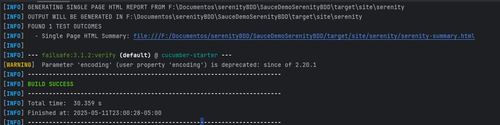
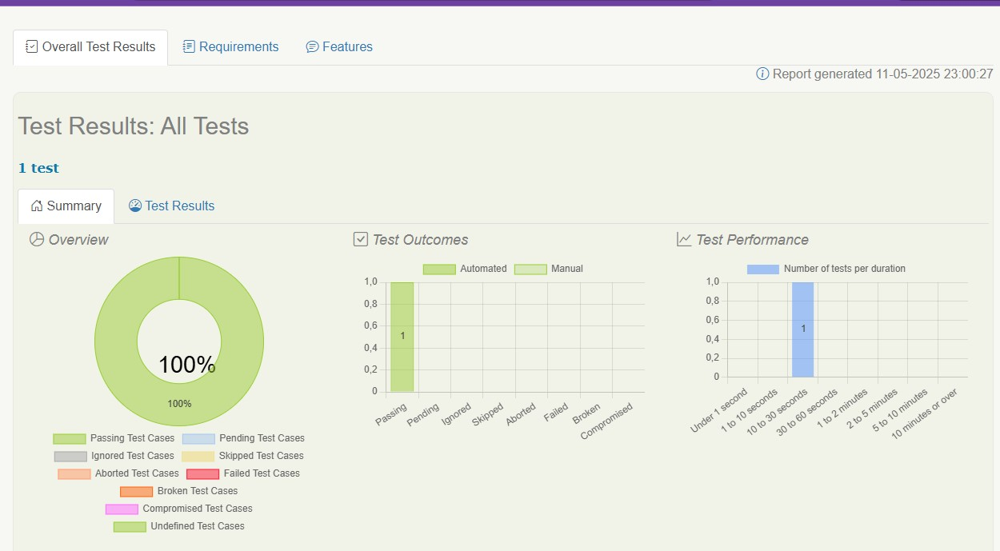

# SerenityBDD Basic Exercise with SaurceDemo
Ejercicio basico E2E para comprar productos en SaurceDemo

# Descripción

El proyecto incluye un escenario para comprar productos exitosamente.
Los productos seleccionados se seleccionan aleatoriamente y se almacena su información para garantizar que mas adelante la data coincide.

---------------------------------------------------------------
	Feature: Cliente compra productos en la pagina SaurceDemo

	@buy2Products
	Scenario: Comprar 2 productos exitosamente

---------------------------------------------------------------

# Estructura Basica del Proyecto

	+ main			
		+ src
			+ test
				+ java
					+ actions
						+ buyProducts
						+ login
						+ navegation
					+ stepDefinitions
					+ UI(UserInterface)
				+ resource
					+ features
						buyProducts.feature
		+ target
			+ site/serenity/index.html(Reporte)

# Requisitos Previos

	- JDK v17.0.9
	- Maven 3.9.6
	- IntellIj (Ultima versión recomendado)

# Instalación y Ejecución de las pruebas sobre el arquetipo de SerenityBdd

1) Clonar el repositorio

	- git clone https://github.com/DavidAlejo24/SauceDemoSerenityBDD.git

2) Navegar hacia el repositorio clonado

	- cd SauceDemoSerenityBDD

3) Ejecutar las pruebas

	- mvn clean verify
	
	
# Ruta informe
El informe se crea en la ruta:
	- target/site/serenity/

Puede visualizarlo mediante el archivo
	- index.html

# Resultados de las pruebas 

Ejecución Exitosa

Reporte generado

